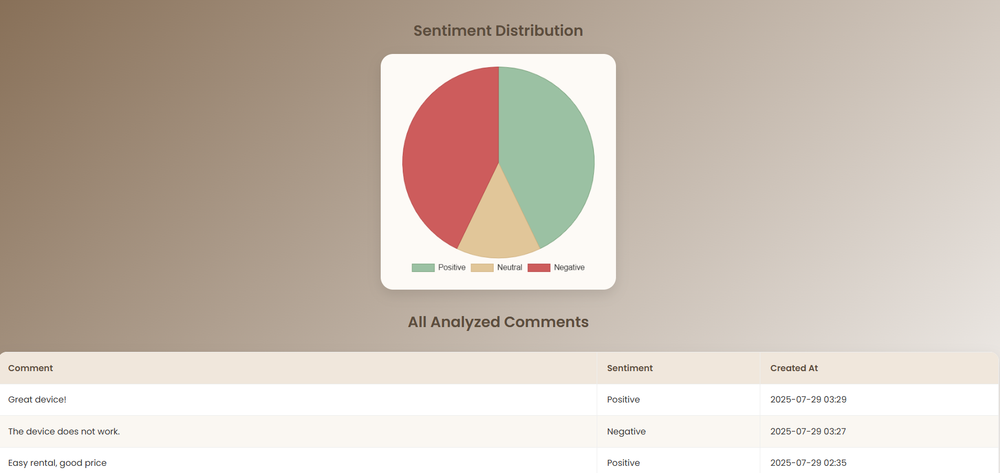

# Sentiment Analysis Dashboard

This is a sentiment analysis web application built with Django and Chart.js.  
It allows users to visualize sentiment classification (Positive, Neutral, Negative) in Arabic using a pre-trained model.

## Features
- Classifies input into: Positive, Negative, or Neutral
- Clean dashboard interface with pie chart visualization
- Pre-trained model for accurate results
